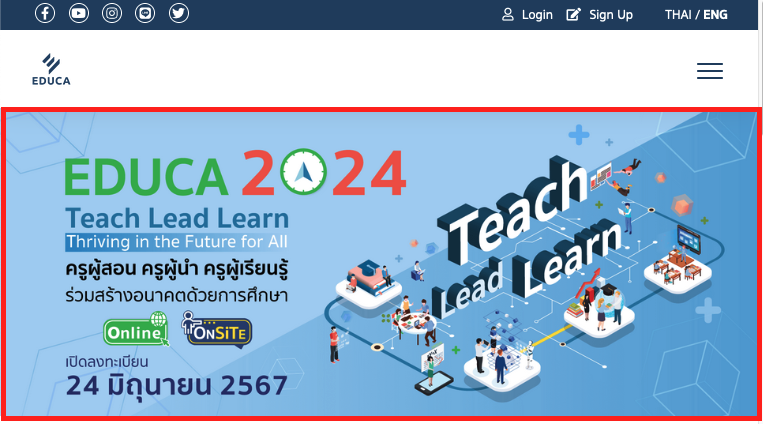
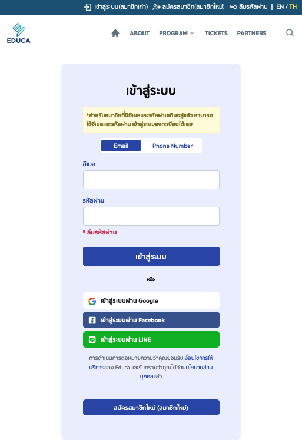

# User Mannual EDUCA2024
## วิธีการลงทะเบียน และชำระค่าอบรม กิจกรรม EDUCA 2024

เอกสารวิธีการลงทะเบียน และชำระค่าอบรม กิจกรรม EDUCA 2024 มหกรรมทางการศึกษาเพื่อการพัฒนาวิชาชีพครู ประจำปี 2567 
- [เข้าสู่เว็บไซต์อบรม EDUCA 2024](#educa-2024)
- [เข้าสู่ระบบสมาชิก](#login)
- [ลืมรหัสผ่าน](#reset-password)

---

## EDUCA 2024
### ช่องทางการเข้าสู่เว็บไซต์สำหรับลงทะเบียน และ อบรม EDUCA 2024

- กดที่ลิ้งค์ [educa2024]
- เข้าผ่าน Web Browser เว็บไซต์ https://event.educathai.com/educa2024
- เข้าผ่าน Banner EDUCA 2024 จากเว็บไซต์ [educathai.com] แล้วกดลิ้งค์ Banner ดังรูป 1.1
- เข้าผ่านปุ่ม Login จากเว็บไซต์ [educathai.com]

{ width=400 }
_1.1 รูปแสดง Banner EDUCA 2024 ที่ลิ้งค์ไปยังเว็บไซต์_

[educa2024]:(https://event.educathai.com/educa2024)
[educathai.com]:(https://www.educathai.com)

---

## Login
### เข้าสู่ระบบสมาชิก
สำหรับคุณครูที่เคยเป็นสมาชิกกับ EDUCA แล้วให้เลือกเข้าสู่ระบบ(สมาชิกเก่า) 
ลิ้งค์สำหรับเข้าสู่ระบบ ​​​[Login] หรือ https://event.educathai.com/educa2024/login

{ width=350 }
_2.1 รูปแสดง Banner EDUCA 2024 ที่ลิ้งค์ไปยังเว็บไซต์_

สามารถเข้าสู่ระบบ ([Login]) ได้ดังนี้
- Email Address
    > โดยเลือกไปที่ Email แล้วกรอกข้อมูลในช่อง ==อีเมล== และ ==รหัสผ่าน== หลังจากนั้นให้กดปุ่ม เข้าสู่ระบบ
- Phone Number
    > โดยเลือกไปที่ Email แล้วกรอกข้อมูลในช่อง ==หมายเลขโทรศัพท์== และ ==รหัสผ่าน== หลังจากนั้นให้กดปุ่ม เข้าสู่ระบบ
- เข้าสู่ระบบด้วย Google Email Account
- เข้าสู่ระบบด้วย Line Account

[Login]:(https://event.educathai.com/educa2024/login)
https://event.educathai.com/educa2024/login

---

## Reset Password
### ลืมรหัสผ่าน
หากจำรหัสผ่านไม่ได้ หรือต้องการเปลื่ยนรหัสผ่าน ให้ปฏิบัติดังนี้
เข้าจากหน้า [Login]
- ==กดปุ่มลืมรหัสผ่าน==จากหน้าเข้าสู่ระบบ [Login] ที่อยู่ข้างล่างช่องกรอกรหัสผ่าน {width=80} จะเข้าสู่หน้า [Reset Password]
- ==กดปุ่มลืมรหัสผ่าน==ที่ Menu bar
- กดที่นี่ [Reset Password] หรือ https://event.educathai.com/educa2024/reset-password

> 1. จากนั้นให้==กรอกข้อมูล Email== ที่เคยสมาชิกกับ EDUCA ไว้
> 2. กดปุ่ม ==ถัดไป==
> 3. ท่านจะได้รับ Email รหัส ==OTP สำหรับรีเซ็ตรหัสผ่าน==เป็นตัวเลขจำนวน 6 หลัก 
>   3.1 รหัส OTP จะส่งจาก ==Email no_reply@educathai.com เท่านั้น==
>   3.2 หากไม่ได้รับ Email ให้ปฏิบัติดังนี้
>       3.2.1 ตรวจสอบ Email จาก Spam-mail, Junk-mail, All-mail
>       3.2.2 หากตรวจสอบแล้วยังไม่ได้รับ Email ให้ตรวจสอบข้อมูล Email ที่กรอกไว้อีกครั้ง หากถูกต้องแล้วให้กดที่คำว่า ==ขอรหัสใหม่== {width=200}
> 4. กลับมาที่เว็บไซต์ Educa หรือ กดจะลิ้งค์ https://event.educathai.com/educa2024/forgot-password จาก Email ให้==กรอกหมายเลข OTP== และ กดปุ่ม==ถัดไป==
> 5. กรอกข้อมูลรหัสผ่านที่ต้องการ และกดบันทึก

[Reset Password]:(https://event.educathai.com/educa2024/reset-password)

---
