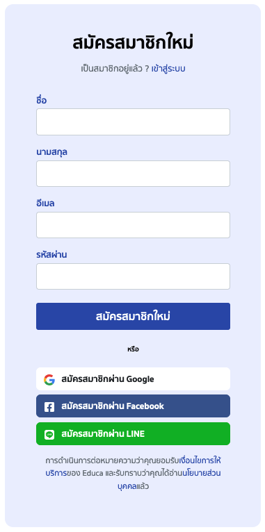
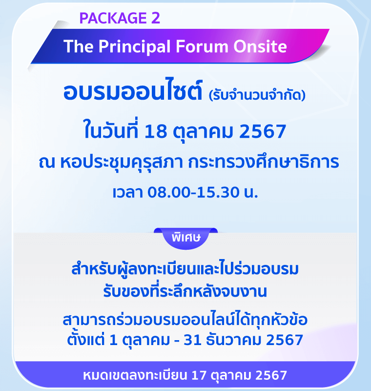
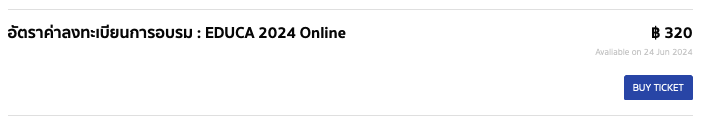
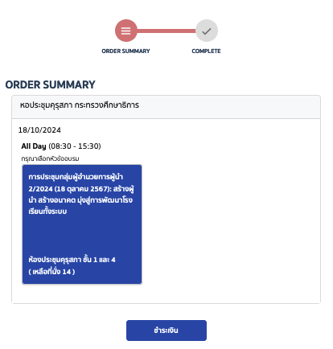

# User Manual EDUCA2024
## วิธีการลงทะเบียน และชำระค่าอบรม กิจกรรม EDUCA 2024

เอกสารวิธีการลงทะเบียน และชำระค่าอบรม กิจกรรม EDUCA 2024 มหกรรมทางการศึกษาเพื่อการพัฒนาวิชาชีพครู ประจำปี 2567 
- [เข้าสู่เว็บไซต์อบรม EDUCA 2024](#educa-2024)
- [เข้าสู่ระบบสมาชิก](#login)
- [ลืมรหัสผ่าน](#reset-password)
- [สมัครสมาชิก เว็บไซต์](#register)
- [การลงทะเบียนเข้าร่วมงาน EDUCA 2024](#event-register)
    - [ขั้นตอนการสมัคร](#ขั้นตอนการสมัคร)
    - [วิธีใช้โค้ดส่วนลด](#โค้ดส่วนลด)
    - [ขั้นตอนการเข้าสู่การชำระเงิน](#ขั้นตอนการเข้าสู่การชำระเงิน)

---

## EDUCA 2024
#### ช่องทางการเข้าสู่เว็บไซต์สำหรับลงทะเบียน และ อบรม EDUCA 2024

- กดที่ลิ้งค์ [EDUCA2024](https://event.educathai.com/educa2024)
- เข้าผ่าน Web Browser เว็บไซต์ https://event.educathai.com/educa2024
- เข้าผ่าน Banner EDUCA 2024 จากเว็บไซต์ [EDUCATHAI](https://www.educathai.com) แล้วกดลิ้งค์ Banner ดังรูป 1.1
- เข้าผ่านปุ่ม Login จากเว็บไซต์ [EDUCATHAI](https://www.educathai.com)

_1.1 รูปแสดง Banner EDUCA 2024 ที่ลิ้งค์ไปยังเว็บไซต์_

---

## Login
#### เข้าสู่ระบบสมาชิก
สำหรับคุณครูที่เคยเป็นสมาชิกกับ EDUCA แล้วให้เลือกเข้าสู่ระบบ(สมาชิกเก่า) 
ลิ้งค์สำหรับเข้าสู่ระบบ ​​​[Login](https://event.educathai.com/educa2024/login) หรือ [https://event.educathai.com/educa2024/login](https://event.educathai.com/educa2024/login)

_2.1 รูปแสดง Banner EDUCA 2024 ที่ลิ้งค์ไปยังเว็บไซต์_

สามารถเข้าสู่ระบบ [Login](https://event.educathai.com/educa2024/login) ได้ดังนี้
- Email Address
    > โดยเลือกไปที่ Email แล้วกรอกข้อมูลในช่อง `อีเมล` และ `รหัสผ่าน` หลังจากนั้นให้กดปุ่ม เข้าสู่ระบบ
- Phone Number
    > โดยเลือกไปที่ Email แล้วกรอกข้อมูลในช่อง `หมายเลขโทรศัพท์` และ `รหัสผ่าน` หลังจากนั้นให้กดปุ่ม เข้าสู่ระบบ
- เข้าสู่ระบบด้วย Google Email Account
- เข้าสู่ระบบด้วย Line Account

---

## Reset Password
#### ลืมรหัสผ่าน
หากจำรหัสผ่านไม่ได้ หรือต้องการเปลื่ยนรหัสผ่าน ให้ปฏิบัติดังนี้
เข้าจากหน้า [Login](https://event.educathai.com/educa2024/login)
- `กดปุ่มลืมรหัสผ่าน` จากหน้าเข้าสู่ระบบ [Login](https://event.educathai.com/educa2024/login) ที่อยู่ข้างล่างช่องกรอกรหัสผ่าน  จะเข้าสู่หน้า [Reset Password]
- `กดปุ่มลืมรหัสผ่าน` ที่ Menu bar
- กดที่นี่ [Reset Password] หรือ [https://event.educathai.com/educa2024/reset-password](https://event.educathai.com/educa2024/reset-password)

1. จากนั้นให้`กรอกข้อมูล Email` ที่เคยสมาชิกกับ EDUCA ไว้
2. กดปุ่ม `ถัดไป`
3. ท่านจะได้รับ Email รหัส `OTP สำหรับรีเซ็ตรหัสผ่าน` เป็นตัวเลขจำนวน 6 หลัก 
> [!WARNING]
> รหัส OTP จะส่งจาก `Email no_reply@educathai.com เท่านั้น`
4. กลับมาที่เว็บไซต์ Educa หรือ กดจะลิ้งค์ [https://event.educathai.com/educa2024/forgot-password](https://event.educathai.com/educa2024/forgot-password) จาก Email ให้ `กรอกหมายเลข OTP` และ กดปุ่ม `ถัดไป`
5. กรอกข้อมูลรหัสผ่านที่ต้องการและกด `บันทึก` เป็นอันเสร็จสิ้น

> [!TIP]
> หากไม่ได้รับ Email OTP สำหรับรีเซ็ตรหัสผ่าน ให้ปฏิบัติดังนี้
> - ตรวจสอบ Email จาก Spam-mail, Junk-mail, All-mail
> - หากตรวจสอบแล้วยังไม่ได้รับ Email ให้ตรวจสอบข้อมูล Email ที่กรอกไว้อีกครั้ง หากถูกต้องแล้วให้กดที่คำว่า "ขอรหัสใหม่" 

> [!NOTE]
> สำหรับคุณครูที่เคยสมัครสมาชิกกับ EDUCA แล้ว ต้องการเปลื่ยน Email ใหม่
> โปรดติดต่อเจ้าหน้าที่ทาง Indox [Facebook Page](https://www.facebook.com/educathai/) | Line OA พิมพ์ ​@educathai

[Reset Password]:(https://event.educathai.com/educa2024/reset-password)

---

## Register
#### สมัครสมาชิกใหม่
สำหรับคุณครูที่ไม่เคยเป็นสมาชิก EDUCA ให้เลือกสมัครสมาชิก (สมาชิกใหม่)

_3.1 รูปแสดง หน้าสมัครสมาชิกใหม่_

ขั้นตอนการสมัครสมาชิกใหม่
1. ใส่ชื่อ นามสกุล อีเมล และ รหัสผ่าน จากนั้นกดปุ่ม "สมัครสมาชิกใหม่"

> [!NOTE]
> สำหรับคุณครูที่เคยสมัครสมาชิกกับ EDUCA แล้ว ต้องการเปลื่ยน Email ใหม่
> โปรดติดต่อเจ้าหน้าที่ทาง Indox [Facebook Page](https://www.facebook.com/educathai/) | Line OA พิมพ์ ​@educathai

2. ใส่หมายเลขโทรศัพท์มือถือเพื่อยืนยันตัวตน ระบบจะส่ง OTP เข้าไปยังโทรศัพท์ นำเลขมาใส่ กด "ถัดไป" เพื่อไปยังหน้าใส่ข้อมูลส่วนบุคคล

> [!WARNING]
> หากหน้าเว็บไซต์แจ้งเตือนว่าหมายเลขดังกล่าวเคยลงทะเบียนไว้แล้ว
> โปรดติดต่อเจ้าหน้าที่ทาง Indox [Facebook Page](https://www.facebook.com/educathai/) | Line OA พิมพ์ ​@educathai

3. ใส่ข้อมูลส่วนบุคคลเป็นอันเสร็จสิ้นการสมัครสมาชิก

> [!WARNING]
> การสมัครสมาชิกยังไม่ได้การลงทะเบียนเข้าร่วมกิจกรรม เป็นเพียงการสมัครสมาชิกของเว็บไซต์เท่านั้น [การลงทะเบียนเข้าร่วมงาน EDUCA 2024](#event-register)

---

## Event Register
#### การลงทะเบียนเข้าร่วมงาน EDUCA 2024

EDUCA 2024 มี 2 Package ให้เลือก ได้แก่
- EDUCA 2024 Online

    

- The Principal Forum Onsite

    

> [!TIP]
> - Package EDUCA 2024 Online จะสามารถดู The Principal Forum Onsite ย้อนหลังได้ในช่องทางออนไลน์ของเว็บไซต์ [EDUCA2024](https://event.educathai.com/educa2024)
> - Package The Principal Forum Onsite มีที่นั่งจำกัด สามารถดู EDUCA 2024 Online ทั้งหมดได้ในช่องทางออนไลน์ของเว็บไซต์ [EDUCA2024](https://event.educathai.com/educa2024)

#### ขั้นตอนการสมัคร
1. กดเลือกเมนู `Tickets` เพื่อไปยังหน้า Tickets
2. กดเลือก Package ที่ต้องการสมัคร และกดปุ่ม `BUY TICKET` ภายใน Package นั้น
    - EDUCA 2024 Online 

        

    - The Principal Forum Onsite

        

> [!TIP]
> หากเลือก Package The Principal Forum Onsite ในช่อง กรุณาเลือกหัวข้ออบรม "การประชุมกลุ่มผู้อำนวยการผู้นำ 2/2024 (18 ตุลาคม 2567): สร้างผู้นำ สร้างอนาคต มุ่งสู่การพัฒนาโรงเรียนทั้งระบบ" ต้องเป็นสีน้ำเงินตามรูปก่อน จึงจะสามารถกดปุ่มชำระเงินได้
> หากเป็นสีขาวให้ทำการกดที่ช่อง กรุณาเลือกหัวข้ออบรม พื้นหลังจะเปลื่ยนเป็นสีฟ้า จากนั้นให้กดปุ่มชำระเงิน เพื่อไปต่อ
>
> 

3. หน้า Order Summary จะแสดงรายละเอียดของ Package ที่เลือกกรุณาตรวจสอบข้อมูลโดยละเอียด
    - ##### โค้ดส่วนลด
        หากมี `โค้ดส่วนลด` ให้กรอกข้อมูลในช่อง `Add Promo Code` จากนั้นให้เลือกกดปุ่ม Add เพื่อทำการตรวจสอบรหัส
> [!WARNING]
> หากไม่ได้กดปุ่ม Add รหัส Promo Code จะไม่ได้ถูกใส่เข้าไปในคำสั่งซื้อ
> หากคุณครูมีโค้ดส่วนลด แต่ทำการกด Place Order ไปแล้ว โดยที่ยังไม่ได้ใส่ ​Promo Code
> โปรดติดต่อเจ้าหน้าที่ทาง Indox [Facebook Page](https://www.facebook.com/educathai/) | Line OA พิมพ์ ​@educathai
    - ตรวจสอบข้อมูล PERSONAL INFORMATION หากต้องการแก้ไขให้เลือกปุ่ม Edit
    - ตรวจสอบข้อมูล BILLING ADDRESS หากต้องการแก้ไขให้เลือกปุ่ม Edit
    - กดปุ่ม `Place Order` เพื่อไปยังขั้นตอนชำระเงิน

4. หน้าใบแจ้งชำระเงิน / Invoice โดยมีช่องทางการชำระเงินดังนี้
    - บัตรเครดิต/บัตรเดบิต 
        > เลือก บัตรเครดิต/บัตรเดบิต แล้วกดปุ่ม `ชำระเงิน` จะมี Popup ปรากฏขึ้นมา ให้ใส่ข้อมูลบัตร แล้วกดปุ่ม `Pay`
    - Unionpay
        > เลือก Unionpay แล้วกดปุ่ม `ชำระเงิน` จากนั้นให้ดำเนินการชำระเงินตามขั้นตอน
    - PromptPay
        > เลือก PromptPay แล้วกดปุ่ม `ชำระเงิน` จากนั้นให้เปิดแอฟธนาคารเพื่อแสกนจ่ายเงิน

> [!WARNING]
> - กรุณาสแกนคิวอาร์โค้ดด้วยโมบายแอปพลิเคชัน ภายใน 10 นาที
> - หากไม่ได้สแกนคิวอาร์โค้ดด้วยโมบายแอปพลิเคชันนานกว่า 10 นาที คิวอาร์โค้ดนี่้จะไม่สามารถใช้ได้ กรุณากลับไปเลือกหัวข้อชำระเงินใหม่อีกครั้ง

5. เมื่อชำระเงินเสร็จสิ้นแล้ว จะได้รับอีเมล และ SMS จาก EDUCA ว่าลงทะเบียน EDUCA 2024 สำเร็จแล้ว หากไม่พบโปรดตรวจสอบในกล่อง Junk Box ของท่าน

> [!TIP]
> ##### ขั้นตอนการเข้าสู่การชำระเงิน
> 1. เข้าสู่ระบบสมาชิก คลิกที่นี่ [EDUCA2024](https://event.educathai.com/educa2024) | https://event.educathai.com/educa2024
> 2. กดลูกศรที่อยู่ข้างชื่อ และนามสกุล เลือก Billing ใน Order มีหัวข้อ EDUCA 2024 ให้เลือก กดชำระเงิน
> 3. ดำเนินการชำระเงินตามขั้นตอน
> 4. เมื่อชำระเงินเสร็จสิ้นแล้ว จะได้รับอีเมล และ SMS จาก EDUCA ว่าลงทะเบียน EDUCA 2024 สำเร็จแล้ว หากไม่พบโปรดตรวจสอบในกล่อง Junk Box ของท่าน